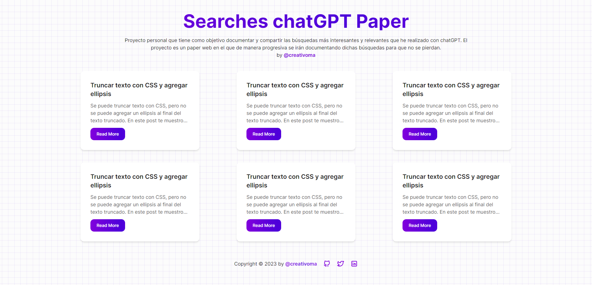

# Searches chatGPT Paper
Utilizando Astro Starter Kit: Basics

Proyecto personal que tiene como objetivo documentar y compartir las búsquedas más interesantes y relevantes que he realizado con chatGPT.

## Screenshot



## Getting Started

```
npm create astro@latest -- --template basics
```

## 🚀 Project Structure

Inside of your Astro project, you'll see the following folders and files:

```
/
├── public/
│   ├── favicon.svg
│   └── search.jpg
├── src/
│   ├── components/
│   │   ├── Card.astro
│   │   ├── Footer.astro
│   │   └── Header.astro
│   ├── layouts/
│   │   ├── BlogPostLayout.astro
│   │   └── Layout.astro
│   └── pages/
│       ├── post/
│       ├── 404.astro
│       └── index.astro
└── package.json
```

## Comandos

Todos los comandos se ejecutan desde la raíz del proyecto, desde una terminal:

| Command                | Action                                           |
| :--------------------- | :----------------------------------------------- |
| `npm install`          | Installs dependencies                            |
| `npm run dev`          | Starts local dev server at `localhost:3000`      |
| `npm run build`        | Build your production site to `./dist/`          |
| `npm run preview`      | Preview your build locally, before deploying     |
| `npm run astro ...`    | Run CLI commands like `astro add`, `astro check` |
| `npm run astro --help` | Get help using the Astro CLI                     |

## Licencia

MIT License - Copyright (c) 2023 Mariano Álvarez
